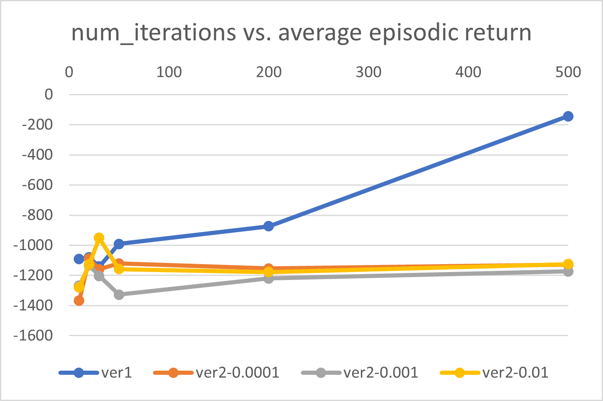
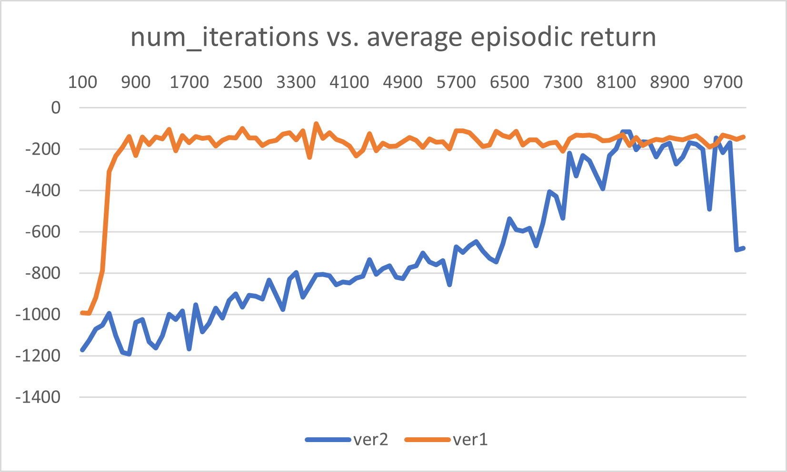

# Progress Report: Finite Difference in Proximal Policy Optimization
**Author:** Hyejun Park  
**Date:** Mar 27, 2025

---

## Introduction

This project explores the use of **finite difference (FD)** gradient estimation in **Proximal Policy Optimization (PPO)**. PPO is a popular reinforcement learning algorithm known for its stability and performance. The goal is to investigate whether FD-based updates can effectively replace traditional backpropagation in training the policy network.

## Understanding PPO

I have read the paper [_Proximal Policy Optimization Algorithms_ (Schulman et al., 2017)](https://arxiv.org/pdf/1707.06347) several times and now have a solid understanding of reinforcement learning fundamentals and the PPO algorithm, supported by my coursework in reinforcement learning. This foundational understanding was essential before attempting to modify the training process.

## Sanity Check: FD vs Backprop

Before modifying PPO, I verified that finite difference (FD) works correctly in a simple regression problem. I trained a neural network to learn the function $y = 2x + 3$ using both:

- Traditional gradient descent with backpropagation
- Finite difference gradient approximation

### Setup

In both cases, I used a single-layer linear model defined as:

```python
class SimpleModel(nn.Module):
    def __init__(self):
        super().__init__()
        self.linear = nn.Linear(1, 1)

    def forward(self, x):
        return self.linear(x)
```

The training data was:

```python
x_train = torch.tensor([[1.0], [2.0], [3.0], [4.0]])
y_train = torch.tensor([[5.0], [7.0], [9.0], [11.0]])
```

<div style="display: flex;">
  <div style="flex: 1; padding: 10px;">

### Backpropagation

Using traditional gradient descent, the model was trained as follows:

```python
for epoch in range(10000):
    optimizer.zero_grad()
    y_pred = model(x_train)
    loss = loss_fn(y_pred, y_train)
    loss.backward()
    optimizer.step()
```

  </div>
  <div style="flex: 1; border-left: 1px solid gray; padding: 10px; box-sizing: border-box;">
  
### Finite Difference

In the FD version, gradients were estimated manually using central difference. Here, `loss_plus` and `loss_minus` are calculated by perturbing the parameter positively and negatively by a small ε.

```python
for epoch in range(10000):
    y_pred = model(x_train)
    loss = loss_fn(y_pred, y_train)

    grads = {}
    for param in model.parameters():
        orig_value = param.data.clone()

        param.data += epsilon
        loss_plus = loss_fn(model(x_train), y_train).item()

        param.data -= 2 * epsilon
        loss_minus = loss_fn(model(x_train), y_train).item()

        param.data = orig_value

        grad = (loss_plus - loss_minus) / (2 * epsilon)
        grads[param] = grad
    
    with torch.no_grad():
        for param in model.parameters():
            param -= lr * grads[param]
```
  </div>
</div>

### Result

Both methods converged to the correct solution. The model predicted approximately $y = 13$ for $x = 5$, confirming that my finite difference implementation is functionally equivalent to backpropagation in this simple setting.

## Implementation of FD in PPO

Using a PPO implementation based on [the Medium tutorial](https://medium.com/@eyyu/coding-ppo-from-scratch-with-pytorch-part-1-4-613dfc1b14c8), I replaced the actor's gradient update step with a central difference approximation:

$$
\frac{f(x + Δ) - f(x - Δ)}{2Δ}
$$

This required modifying the model's `learn()` method and estimating gradients over all parameters using multiple forward passes.

The environment used for all experiments is `Pendulum-v1`, which has continuous observation and action spaces.

## Initial Experiment

### Experiment Settings

- Environment: `Pendulum-v1`
- Versions Tested:
  - `ver1`: Standard PPO using backpropagation  
  - `ver2`: PPO with Finite Difference (FD) gradient estimation
- Tested Iteration Counts: 10, 20, 30, 50, 200, 500
- FD Epsilon Values: `0.0001`, `0.001`, `0.01`
- Metrics Tracked: 
  - Average Episodic Return

### Observations and Results

<div align="center">
    
</div>

- `ver1` (backprop) showed clear and rapid improvement in return as the number of iterations increased, particularly after 200 iterations.
- `ver2` (FD) appeared to **not learn at all** during these shorter training runs.
  - Even at 500 iterations, `ver2` remained significantly worse than `ver1`, leading to the initial assumption that the method might be flawed.
  - In hindsight, we now believe this was due to **extremely slow learning**, not a complete failure.
- No meaningful trend was observed across different values of `epsilon`; **results did not appear to be particularly sensitive** to `epsilon` in this range.
- Training time increased proportionally with the number of iterations. `ver2` took slightly longer than `ver1`, likely due to the multiple forward passes required for gradient approximation.

## Longer Training: Verifying ver2 Does Learn (Eventually)

After observing that `ver2` seemed unable to learn, I suspected there might be a deeper issue with the implementation. However, further inspection and extended runs revealed that the problem was **not with correctness, but with the speed of learning**.

To verify this, I ran both versions with **10,000 iterations** and compared the final performance.

### Experiment Details

- **Version**: `ver1` (backprop) vs `ver2` (finite difference)
- **Environment**: `Pendulum-v1`
- **FD epsilon (ε)**: 0.05
- **Iterations**: 10,000
- **Metrics Measured**:
  - Average Episodic Return
  - Total Training Time

### Observations

<div align="center">
    
</div>

- `ver2` **does learn**, but the learning process is extremely **slow and gradual**.
- The final average episodic return was **comparable** to `ver1`, though `ver2` took significantly longer.
- This confirms that the FD-based PPO implementation is functionally correct, albeit inefficient.

### Training Time Analysis

The time required for training each version is significantly different — both in terms of **time per iteration** and the **number of iterations needed** to see meaningful learning.

#### Iteration Time Comparison

| Version | Time per Iteration | Relative Cost |
|---------|--------------------|----------------|
| ver1    | ~0.4–0.5 sec       | 1×             |
| ver2    | ~4–5 sec           | **10× slower** |

- `ver2` requires **multiple forward passes per parameter** for gradient estimation using finite difference, which explains the slowdown.
- Additionally, `ver2` needs **far more iterations** to achieve comparable results.

#### Total Time Estimate

| Version | Iterations to Converge | Total Time Estimate |
|---------|------------------------|---------------------|
| ver1    | ~500–1000              | ~3–8 minutes        |
| ver2    | ~8000+                | **>10 hours**       |

Even though `ver2` can eventually learn, the **computational cost is prohibitively high** compared to traditional backpropagation. This severely limits its practicality in large-scale or time-sensitive settings without further optimization (e.g., batching, vectorization, or parallelization).

## Challenges

- **High computational cost**: FD requires multiple forward passes per parameter per update, leading to ~10× longer training time per iteration.
- **Slow convergence**: Ver2 needs significantly more iterations (e.g., 10000+) to show signs of learning.
- **Noise in gradients**: FD gradients are noisy and may require smoothing or averaging to improve stability.
- **Hyperparameter tuning is fragile**: Learning rate and epsilon have a narrow range where learning is stable.

## Next Steps

The immediate focus is to **speed up ver2** and improve its stability. Planned directions include:

- **Batch perturbations**: Estimate multiple FD gradients in parallel using vectorized operations or per-layer updates.
- **Gradient averaging**: Average multiple FD estimates per parameter to reduce noise.
- **Explore SPSA** (Simultaneous Perturbation Stochastic Approximation): A more sample-efficient alternative to FD that perturbs all parameters at once.
- **Evaluate simpler environments**: Run tests on lower-dimensional environments to isolate issues without long training times.

## Conclusion

I implemented finite difference updates for PPO and verified their correctness in a toy regression task. While FD-based PPO (ver2) does eventually learn, it requires:

- Much **longer training time**
- Careful tuning
- Potential architectural optimization

As it stands, ver2 is **impractically slow** compared to backpropagation, but it provides a strong foundation for exploring **alternative training strategies** in reinforcement learning, especially those that don't rely on automatic differentiation.

My next step is to **optimize ver2**, starting with performance improvements and exploring alternatives like SPSA or hybrid updates.