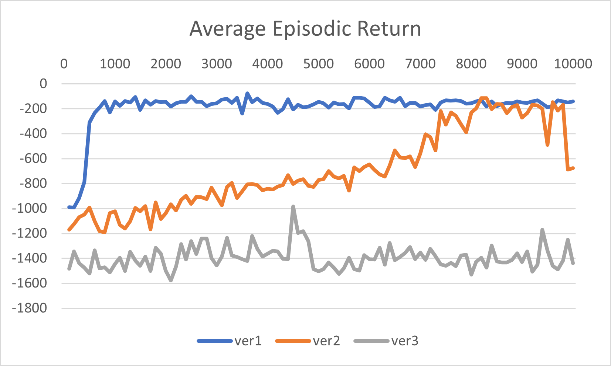

# PPO Finite Difference - Ver3 Report  
**Author:** Hyejun Park  
**Date:** April 2, 2025

## Introduction

This brief report summarizes the performance and observations for **ver3**, a new variant of PPO where each training iteration randomly chooses between:

- `ver1` (backpropagation-based PPO)  
- `ver2` (finite difference PPO)  

with 50% probability.

The motivation was to potentially balance the strengths of both approaches. However, the results were unexpectedly poor.

## Experimental Setup

- Environment: `Pendulum-v1`
- Epsilon: `0.05` for FD
- Iterations: `10,000`
- Random selection between ver1 and ver2 per iteration (probability = 0.5)

## Results and Observations

- The model failed to learn. Average episodic return remained in the range of **-1700 to -1400**, which is worse than either ver1 or ver2 alone.
- There was **no noticeable upward trend** in return over 10,000 iterations.
- It appeared that mixing two learning paradigms interfered with stability.

## Iteration Time

| Version | Avg. Time per Iteration |
|---------|-------------------------|
| ver1    | ~0.4–0.5 sec            |
| ver2    | ~4–5 sec                |
| ver3    | ~2.5–3 sec on average   |

## Performance Comparison Plot

- **ver1 (blue)**: Rapid learning. Within the first ~1,000 iterations, it reaches high performance and stays consistent, showing **strong convergence and stability**.
- **ver2 (orange)**: Much slower, but steady learning. It improves over time and catches up around ~9,000 iterations. This confirms that finite difference *can* work, albeit with more time.
- **ver3 (gray)**: Clearly underperforms. It hovers around -1500 and never shows any sign of meaningful learning. The curve is **flat and noisy**, which strongly suggests that the random switching between backprop and FD breaks the learning dynamic.

> **Mixing ver1 and ver2 randomly doesn't leverage the strengths of either — it seems to dilute both.**

## Discussion

- Randomly switching between two fundamentally different update rules causes inconsistency.
- ver3 spends significant time on FD updates, which are slower and less effective in the early stages.
- Backprop updates in ver1 are effective when used consistently — interrupting them breaks momentum.

## Conclusion

The random update strategy in ver3 **did not improve** performance. Instead, it introduced instability and inconsistency in learning.

> A better hybrid strategy (e.g., phased switching, or gradual transition from ver1 to ver2) might be worth exploring instead.

## Next Steps

The unexpectedly poor performance of ver3 highlights the need for deeper analysis. The immediate directions I plan to pursue are:

1. **Diagnose ver3 failure**: Investigate why mixing ver1 and ver2 (50-50) results in performance far worse than either alone. Hypotheses include gradient interference, scale mismatches, and instability in PPO's trust-region dynamics.

2. **Improve ver2**: Since ver2 remains much slower and less stable, I will explore ways to make it more effective. This includes:
   - Hyperparameter tuning (learning rate, epsilon)
   - Batch-size scaling for more stable FD estimates
   - Averaging across multiple perturbations per parameter
   - Switching to more efficient FD methods such as **SPSA (Simultaneous Perturbation Stochastic Approximation)**